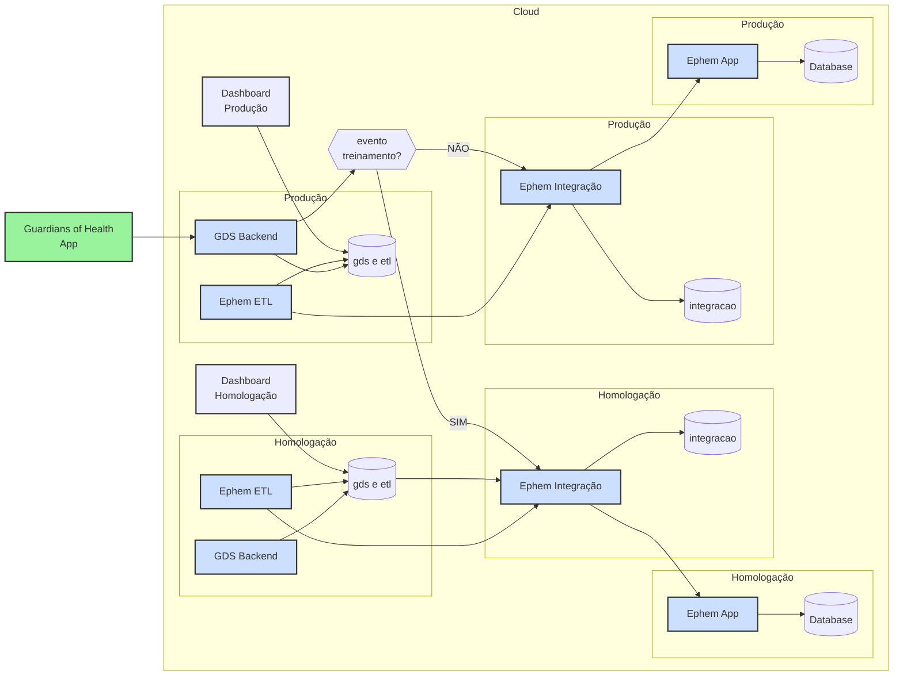

# Visão Implantação

Os componentes do sistema são implantados em ambientes distintos, conforme a finalidade de cada um. A seguir, são apresentados os ambientes e suas respectivas funções:

A seguir uma descrição de cada um dos componentes utilizados na arquitetura:

1. **Guardians of Health App (GH)**
- Aplicativo móvel Android desenvolvido com React Native
- Interface principal para usuários finais
- Responsável pela coleta de dados de saúde
- Comunica-se com o backend de produção (GDSB2)

2. **Dashboards (DH/DP)**
- Implementados usando Google Data Studio
- DH: Dashboard de Homologação para análise de dados em ambiente de teste
- DP: Dashboard de Produção para visualização de dados em produção
- Conectam-se aos respectivos bancos de dados PostgreSQL

3. **GDS Backend (GDSB1/GDSB2)**
- Desenvolvido em Java 11
- GDSB1: Backend de homologação
- GDSB2: Backend de produção
- Possui lógica para direcionamento de eventos (treinamento vs. produção)
- Containerizado com Docker

4. **Ephem ETL (ETL1/ETL2)**
- Sistema de Extração, Transformação e Carga de dados
- ETL1: Processo ETL do ambiente de homologação
- ETL2: Processo ETL do ambiente de produção
- Implementado em Java 11
- Containerizado com Docker

5. **Ephem Integração (EI1/EI2)**
- Sistema de integração com Odoo
- EI1: Integração no ambiente de homologação
- EI2: Integração no ambiente de produção
- Desenvolvido em Java 11, [Spring Boot](https://spring.io/projects/spring-boot)
- Gerencia fluxo de dados entre sistemas

6. **Ephem App (EA1/EA2)**
- Interface web administrativa
- EA1: Aplicação web de homologação
- EA2: Aplicação web de produção
- Desenvolvida sobre a plataform [Odoo](https://www.odoo.com/)
- Containerizada com Docker

7. **Bancos de Dados**
- Implementados em PostgreSQL
- DB1/DB2: Bancos principais para GDS e ETL
- DBI1/DBI2: Bancos para integração
- DBA1/DBA2: Bancos para aplicação web

8. **Infraestrutura**
- Hospedada na Digital Ocean
- Gerenciamento de código via GitHub
- Containerização com Docker
- Ambientes segregados em homologação e produção

9. **Fluxo de Decisão**
- Sistema inteligente para rotear eventos
- Diferencia eventos de treinamento dos eventos reais
- Direciona dados apropriadamente entre ambientes

Toda a infraestrutura está organizada em containers Docker, facilitando o deploy e a escalabilidade. O sistema utiliza uma arquitetura distribuída com separação clara entre ambientes de homologação e produção, garantindo segurança e confiabilidade no processamento dos dados.
