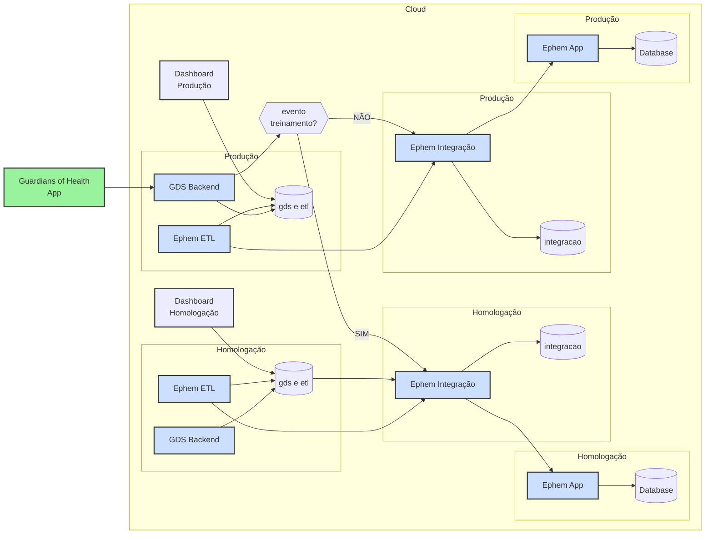

# Visão Implantação

Os componentes do sistema são implantados em ambientes distintos, conforme a finalidade de cada um. A seguir, são apresentados os ambientes e suas respectivas funções:

```mermaid
flowchart LR
    GH["Guardians of Health<br>App"]

    subgraph DO["Cloud"]
    
        DH["Dashboard<br>Homologação"]
        DP["Dashboard<br>Produção"]
        subgraph P1["Homologação"]
            ETL1["Ephem ETL"]
            DB1[("gds e etl")]
            GDSB1["GDS Backend"]
        end

        subgraph P2["Produção"]
            ETL2["Ephem ETL"]
            DB2[("gds e etl")]
            GDSB2["GDS Backend"]
        end
        subgraph M1["Homologação"]
            EI1["Ephem Integração"]
            DBI1[("integracao")]
        end

        subgraph M2["Produção"]
            EI2["Ephem Integração"]
            DBI2[("integracao")]
        end
        
        subgraph U1["Homologação"]
            EA1["Ephem App"]
            DBA1[("Database")]
        end

        subgraph U2["Produção"]
            EA2["Ephem App"]
            DBA2[("Database")]
        end
        
    GDSB2 --> DECISAO{{"evento<br>treinamento?"}}
    DECISAO -- "NÃO" --> EI2
    DECISAO -- "SIM" --> EI1
    end

    DH --> DB1
    DP --> DB2
    GH --> GDSB2

    ETL1 --> DB1
    ETL2 --> EI2
    GDSB1 --> DB1
    DB1 --> EI1
    ETL1 --> EI1

    ETL2 --> DB2
    GDSB2 --> DB2

    EI1 --> DBI1
    EI1 --> EA1
    EI2 --> DBI2
    EI2 --> EA2

    EA1 --> DBA1
    EA2 --> DBA2

    classDef api fill:#ccdfff,stroke:#333,stroke-width:2px
    class ETL1,ETL2,GDSB1,GDSB2,EI1,EI2,EA1,EA2 api

    style DH fill:#gray,stroke:#333,stroke-width:2px
    style DP fill:#gray,stroke:#333,stroke-width:2px
    style GH fill:#99f29c,stroke:#333,stroke-width:2px

```

