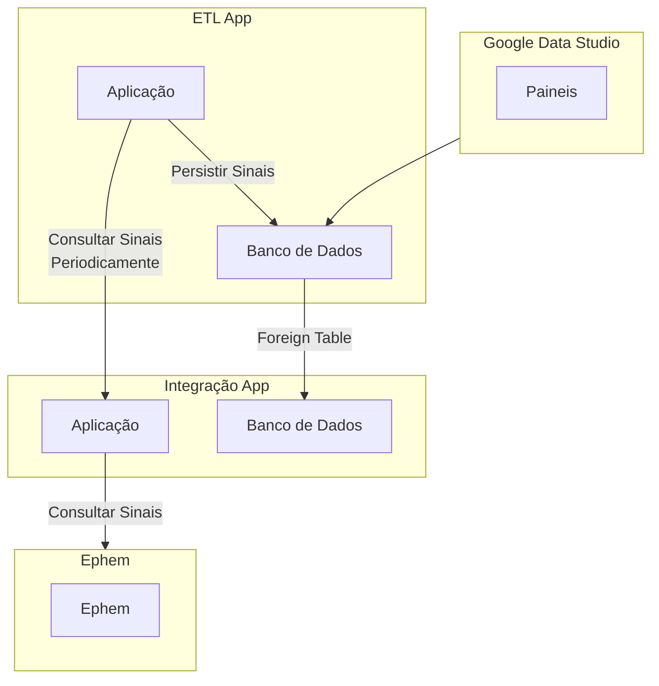

---

---

# Aplicação de ETL

O processo de ETL é responsável por extrair, transformar e carregar dados de diferentes fontes para o banco de dados do projeto. A aplicação de ETL é composta por três etapas principais:

1. Extração: os dados são extraídos das fontes de dados originais.
2. Transformação: os dados são transformados para o formato desejado.
3. Carregamento: os dados são carregados no banco de dados do projeto.

## Visão Geral

Esta aplicação age como um middleware entre o aplicativo guardiões da saúde e o ephem.

O processo realiza a sincronização periódica de quatro tipos principais de dados:

- Sinais
- Fontes 
- Ações Tomadas
- Recomendações Técnicas

## Configuração

O processo utiliza uma configuração central que define:

- URL do servidor remoto 
- Intervalo de sincronização em segundos (padrão: 360s)

## Funcionamento

Para cada tipo de dado, o processo:

1. Remove todos os registros existentes
2. Consulta a API remota com paginação (100 registros por página)
3. Para cada página:
   - Faz requisição HTTP GET para o endpoint específico
   - Processa os dados retornados
   - Salva os registros no banco de dados local
   - Avança para próxima página se houver mais dados
4. Registra logs do progresso

### Endpoints Utilizados

Os dados são buscados nos seguintes endpoints da API:

- `/api-integracao/v1/signals` - Sinais
- `/api-integracao/v1/models/eoc.signal.sources` - Fontes
- `/api-integracao/v1/models/eoc.signal.actions.taken` - Ações Tomadas  
- `/api-integracao/v1/models/eoc.signal.technical.recommendation` - Recomendações Técnicas

## Views

A partir dos dados carregados, são criadas views para facilitar a consulta. Consulte [as view relacionadas](./02-fontes-dados.md#banco-de-dados-do-etl).

## Agendamento

O processo é executado periodicamente através de um scheduler que:

- Mantém um pool de até 100 threads
- Executa cada sincronização no intervalo configurado
- Usa intervalo padrão de 360s se configuração não disponível
- Reagenda próxima execução após término

## Tratamento de Erros

O processo:

- Valida configurações antes de iniciar
- Registra logs de erro detalhados
- Usa valores padrão quando configurações indisponíveis
- Propaga erros para permitir retry automático

## Transações

Cada sincronização é executada em uma transação própria para garantir:

- Atomicidade das operações
- Rollback em caso de erro
- Consistência dos dados

## Ambiente

O processo foi desenvolvido usando:

- Java
- Spring Framework
- JPA/Hibernate
- Lombok
- PostgreSQL

## Monitoramento

O processo gera logs detalhados que permitem acompanhar:

- Início/fim de cada sincronização
- Quantidade de registros processados
- Erros e exceções
- Tempo de execução

## Repositório

https://github.com/GleytonLima/gds-ephem-etl