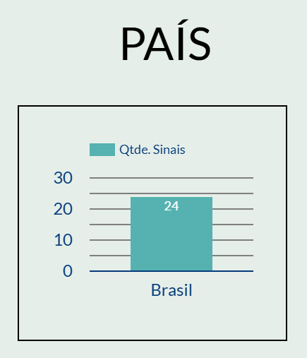
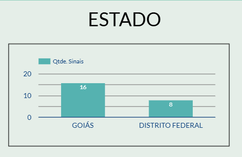
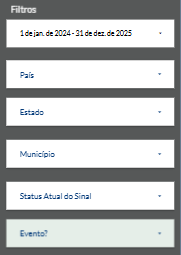

# Widgets

Widgets são componentes visuais que exibem informações de forma clara e objetiva. No Google Data Studio, os widgets são utilizados para a criação de dashboards que apresentam informações de líderes e reportes para acompanhamento dos pontos focais e equipe do projeto.

## Filtros por Usuário

O Google Data Studio não possui um filtro nativo por usuário. Para contornar essa limitação, foi criado uma planilha no Google Sheets que contém três colunas: `email`, `country` e `state`. Essa planilha é utilizada como fonte de dados para o filtro de usuário.

### Página 1
#### Widget Quantidade de Sinais

| Atributo              | Valor                                                                        |
| --------------------- | ---------------------------------------------------------------------------- |
| Tipo                  | Visão geral                                                                  |
| Fonte de dados        | [gds_ephem_integracao_view_cache_join](02-fontes-dados.md#tabelas-mescladas) |
| Campo Principal       | Métrica                                                                      |
| Contagem              | qtde                                                                         |
| Tipo de dados         | Número                                                                       |
| Formato de exibição   | Padrão                                                                       |
| Agregação             | Contagem                                                                     |
| Cálculo de comparação | Nenhum                                                                       |
| Cálculo em execução   | Nenhuma                                                                      |

#### Widget Quantidade Eventos

| Atributo              | Valor                                                                        |
| --------------------- | ---------------------------------------------------------------------------- |
| Tipo                  | Visão geral                                                                  |
| Fonte de dados        | [gds_ephem_integracao_view_cache_join](02-fontes-dados.md#tabelas-mescladas) |
| Campo Principal       | Métrica                                                                      |
| Contagem              | evento                                                                       |
| Tipo de dados         | Número                                                                       |
| Formato de exibição   | Padrão                                                                       |
| Agregação             | Contar Diferentes                                                            |
| Cálculo de comparação | Nenhum                                                                       |
| Cálculo em execução   | Nenhuma                                                                      |

#### Widget Quantidade de Sinais por País

| Atributo              | Valor                                                                        |
| --------------------- | ---------------------------------------------------------------------------- |
| Tipo                  | Gráfico de colunas                                                           |
| Fonte de dados        | [gds_ephem_integracao_view_cache_join](02-fontes-dados.md#tabelas-mescladas) |
| Dimensão              | pais                                                                         |
| Métrica               | Soma                                                                         |
| Campo de Origem       | qtde                                                                         |
| Tipo de dados         | Número                                                                       |
| Formato de exibição   | Padrão                                                                       |
| Agregação             | Soma                                                                         |
| Cálculo de comparação | Nenhum                                                                       |
| Cálculo em execução   | Nenhuma                                                                      |
| Classificar           | Soma(qtde)                                                                   |

#### Widget Quantidade de Sinais por Estado

| Atributo              | Valor                                                                        |
| --------------------- | ---------------------------------------------------------------------------- |
| Tipo                  | Gráfico de colunas                                                           |
| Fonte de dados        | [gds_ephem_integracao_view_cache_join](02-fontes-dados.md#tabelas-mescladas) |
| Dimensão              | state                                                                        |
| Métrica               | Soma                                                                         |
| Campo de origem       | qtde                                                                         |
| Tipo de dados         | Número                                                                       |
| Formato de exibição   | Padrão                                                                       |
| Agregação             | Soma                                                                         |
| Cálculo de comparação | Nenhum                                                                       |
| Cálculo em execução   | Nenhuma                                                                      |
| Classificar           | Soma(qtde)                                                                   |

#### Widget Quantidade de Sinais por Cidade

| Atributo              | Valor                                                                        |
| --------------------- | ---------------------------------------------------------------------------- |
| Tipo                  | Gráfico de colunas                                                           |
| Fonte de dados        | [gds_ephem_integracao_view_cache_join](02-fontes-dados.md#tabelas-mescladas) |
| Dimensão              | municipio                                                                    |
| Métrica               | Soma                                                                         |
| Campo de origem       | qtde                                                                         |
| Tipo de dados         | Número                                                                       |
| Formato de exibição   | Padrão                                                                       |
| Agregação             | Soma                                                                         |
| Cálculo de comparação | Nenhum                                                                       |
| Cálculo em execução   | Nenhuma                                                                      |
| Classificar           | Soma(qtde)                                                                   |

#### Widget Quantidade de Sinais por Status e Percentual

| Atributo                | Valor                                                                        |
| ----------------------- | ---------------------------------------------------------------------------- |
| Tipo                    | Tabela                                                                       |
| Fonte de dados          | [gds_ephem_integracao_view_cache_join](02-fontes-dados.md#tabelas-mescladas) |
| Dimensão                | status                                                                       |
| Métrica 1               | Contagem                                                                     |
| Campo de origem 1       | status                                                                       |
| Tipo de dados 1         | Número                                                                       |
| Formato de exibição 1   | Padrão                                                                       |
| Agregação 1             | Contagem                                                                     |
| Cálculo de comparação 1 | Nenhum                                                                       |
| Cálculo em execução 1   | Nenhuma                                                                      |
| Métrica 2               | Contagem                                                                     |
| Campo de origem 2       | status                                                                       |
| Tipo de dados 2         | Porcentagem                                                                  |
| Formato de exibição 2   | Contagem                                                                     |
| Cálculo de comparação 2 | Porcentagem do total                                                         |
| Cálculo em execução 2   | Nenhuma                                                                      |
| Exibir linha de resumo  | Sim                                                                          |

#### Widget Quantidade de Sinais por Ocorrência

| Atributo                | Valor                                                                        |
| ----------------------- | ---------------------------------------------------------------------------- |
| Tipo                    | Tabela                                                                       |
| Fonte de dados          | [gds_ephem_integracao_view_cache_join](02-fontes-dados.md#tabelas-mescladas) |
| Dimensão                | ocorrência                                                                   |
| Métrica 1               | Contagem                                                                     |
| Campo de origem 1       | qtde                                                                         |
| Tipo de dados 1         | Número                                                                       |
| Formato de exibição 1   | Padrão                                                                       |
| Agregação 1             | Contagem                                                                     |
| Cálculo de comparação 1 | Nenhum                                                                       |
| Cálculo em execução 1   | Nenhuma                                                                      |
| Métrica 2               | Contagem                                                                     |
| Campo de origem 2       | qtde                                                                         |
| Tipo de dados 2         | Porcentagem                                                                  |
| Formato de exibição 2   | Padrão                                                                       |
| Agregação 2             | Contagem                                                                     |
| Cálculo de comparação 2 | Porcentagem do total                                                         |
| Cálculo em execução 2   | Nenhuma                                                                      |
| Exibir linha de resumo  | Sim                                                                          |
| Filtro 1                | Excluir registros qtde Nulo                                                  |

#### Widget Quantidade de Sinais por Afetados

| Atributo                | Valor                                                                        |
| ----------------------- | ---------------------------------------------------------------------------- |
| Tipo                    | Tabela                                                                       |
| Fonte de dados          | [gds_ephem_integracao_view_cache_join](02-fontes-dados.md#tabelas-mescladas) |
| Dimensão                | afetados                                                                     |
| Métrica 1               | Contagem                                                                     |
| Campo de origem 1       | status                                                                       |
| Tipo de dados 1         | Número                                                                       |
| Formato de exibição 1   | Padrão                                                                       |
| Agregação 1             | Contagem                                                                     |
| Cálculo de comparação 1 | Nenhum                                                                       |
| Cálculo em execução 1   | Nenhuma                                                                      |
| Métrica 2               | Contagem                                                                     |
| Campo de origem 2       | status                                                                       |
| Tipo de dados 2         | Porcentagem                                                                  |
| Formato de exibição 2   | Padrão                                                                       |
| Agregação 2             | Contagem                                                                     |
| Cálculo de comparação 2 | Porcentagem do total                                                         |
| Cálculo em execução 2   | Nenhuma                                                                      |
| Exibir linha de resumo  | Sim                                                                          |

#### Widget Quantidade de Sinais por Status Andamento

| Atributo                | Valor                                                                        |
| ----------------------- | ---------------------------------------------------------------------------- |
| Tipo                    | Tabela                                                                       |
| Fonte de dados          | [gds_ephem_integracao_view_cache_join](02-fontes-dados.md#tabelas-mescladas) |
| Dimensão                | ephem_dias_passados                                                          |
| Métrica 1               | Contagem                                                                     |
| Campo de origem 1       | qtde                                                                         |
| Tipo de dados 1         | Número                                                                       |
| Formato de exibição 1   | Padrão                                                                       |
| Agregação 1             | Contagem                                                                     |
| Cálculo de comparação 1 | Nenhum                                                                       |
| Cálculo em execução 1   | Nenhuma                                                                      |
| Métrica 2               | Contagem                                                                     |
| Campo de origem 2       | qtde                                                                         |
| Tipo de dados 2         | Porcentagem                                                                  |
| Formato de exibição 2   | Padrão                                                                       |
| Agregação 2             | Contagem                                                                     |
| Cálculo de comparação 2 | Porcentagem do total                                                         |
| Cálculo em execução 2   | Nenhuma                                                                      |
| Exibir linha de resumo  | Sim                                                                          |
| Filtro 1                | Excluir registros qtde Nulo                                                  |
| Filtro 2                | Excluir registros status = Descartado e status = Encerrado                   |

#### Widget Quantidade de Sinais Informados por Dia

| Atributo                | Valor                                                                        |
| ----------------------- | ---------------------------------------------------------------------------- |
| Tipo                    | Gráfico de série temporal                                                    |
| Fonte de dados          | [gds_ephem_integracao_view_cache_join](02-fontes-dados.md#tabelas-mescladas) |
| Dimensão                | data de detecção                                                             |
| Métrica 1               | Soma                                                                         |
| Campo de origem 1       | qtde                                                                         |
| Tipo de dados 1         | Número                                                                       |
| Formato de exibição 1   | Padrão                                                                       |
| Agregação 1             | Contagem                                                                     |
| Cálculo de comparação 1 | Nenhum                                                                       |
| Cálculo em execução 1   | Nenhuma                                                                      |
| Período Padrão          | Personalizado (Este trimestre)                                               |

#### Widget Registros Completos por Dia

| Atributo       | Valor                                                                        |
| -------------- | ---------------------------------------------------------------------------- |
| Tipo           | Tabela                                                                       |
| Fonte de dados | [gds_ephem_integracao_view_cache_join](02-fontes-dados.md#tabelas-mescladas) |
| Dimensão 1     | data de detecção                                                             |
| Dimensão 2     | país                                                                         |
| Dimensão 3     | estado                                                                       |
| Dimensão 4     | cidade                                                                       |
| Dimensão 5     | ocorrencia                                                                   |
| Dimensão 6     | afetados                                                                     |
| Dimensão 7     | status                                                                       |
| Dimensão 8     | ephem_dias_passados                                                          |

#### Widget Filtros Página 1

- Controle de Período (https://cloud.google.com/looker/docs/studio/date-range-control)
- Filtro de País
- Filtro de Estado
- Filtro de Municipio
- Filtro de Status do Sinal

### Página 2

#### Widget Reportes Por País

| Atributo              | Valor                                                          |
| --------------------- | -------------------------------------------------------------- |
| Tipo                  | Gráfico de colunas                                             |
| Fonte de dados        | [vbe_signals_cache_join](02-fontes-dados.md#tabelas-mescladas) |
| Dimensão              | usuario_pais                                                   |
| Métrica               | Contagem                                                       |
| Campo de origem       | usuario_id                                                     |
| Tipo de dados         | Número                                                         |
| Formato de exibição   | Padrão                                                         |
| Agregação             | Contagem                                                       |
| Cálculo de comparação | Nenhum                                                         |
| Cálculo em execução   | Nenhuma                                                        |
| Classificar           | Contagem(usuario_id)                                           |

#### Widget Reportes Por Estado

| Atributo              | Valor                                                          |
| --------------------- | -------------------------------------------------------------- |
| Tipo                  | Gráfico de colunas                                             |
| Fonte de dados        | [vbe_signals_cache_join](02-fontes-dados.md#tabelas-mescladas) |
| Dimensão              | state                                                          |
| Métrica               | Contagem                                                       |
| Campo de origem       | usuario_id                                                     |
| Tipo de dados         | Número                                                         |
| Formato de exibição   | Padrão                                                         |
| Agregação             | Contagem                                                       |
| Cálculo de comparação | Nenhum                                                         |
| Cálculo em execução   | Nenhuma                                                        |
| Classificar           | Contagem(usuario_id)                                           |

#### Widget Reportes Por Cidade

| Atributo              | Valor                                                          |
| --------------------- | -------------------------------------------------------------- |
| Tipo                  | Gráfico de colunas                                             |
| Fonte de dados        | [vbe_signals_cache_join](02-fontes-dados.md#tabelas-mescladas) |
| Dimensão              | usuario_cidade                                                 |
| Métrica               | Contagem                                                       |
| Campo de origem       | usuario_id                                                     |
| Tipo de dados         | Número                                                         |
| Formato de exibição   | Padrão                                                         |
| Agregação             | Contagem                                                       |
| Cálculo de comparação | Nenhum                                                         |
| Cálculo em execução   | Nenhuma                                                        |
| Classificar           | Contagem(usuario_id)                                           |

#### Widget Total de Reportes

| Atributo              | Valor                                                          |
| --------------------- | -------------------------------------------------------------- |
| Tipo                  | Visão geral                                                    |
| Fonte de dados        | [vbe_signals_cache_join](02-fontes-dados.md#tabelas-mescladas) |
| Campo Principal       | Métrica                                                        |
| Contagem              | evento_tipo_reporte                                            |
| Tipo de dados         | Número                                                         |
| Formato de exibição   | Padrão                                                         |
| Agregação             | Contagem                                                       |
| Cálculo de comparação | Nenhum                                                         |
| Cálculo em execução   | Nenhuma                                                        |

#### Widget Total de Reportes Positivos (Sinais)

| Atributo            | Valor                                                          |
| ------------------- | -------------------------------------------------------------- |
| Tipo                | Visão geral                                                    |
| Fonte de dados      | [vbe_signals_cache_join](02-fontes-dados.md#tabelas-mescladas) |
| Campo Principal     | Métrica                                                        |
| Contagem            | usuario_id                                                     |
| Tipo de dados       | Número                                                         |
| Formato             | Padrão                                                         |
| Agregação           | Contagem                                                       |
| Cálculo             | Nenhum                                                         |
| Cálculo em execução | Nenhuma                                                        |
| Filtro              | Incluir evento_tipo_reporte = positive                         |

#### Widget Total de Reportes Negativos

| Atributo              | Valor                                                          |
| --------------------- | -------------------------------------------------------------- |
| Tipo                  | Visão geral                                                    |
| Fonte                 | [vbe_signals_cache_join](02-fontes-dados.md#tabelas-mescladas) |
| Campo Principal       | Métrica                                                        |
| Contagem              | usuario_id                                                     |
| Tipo de dados         | Número                                                         |
| Formato de exibição   | Padrão                                                         |
| Agregação             | Contagem                                                       |
| Cálculo de comparação | Nenhum                                                         |
| Cálculo em execução   | Nenhuma                                                        |
| Filtro                | Incluir evento_tipo_reporte = negative                         |

#### Widget Total de Reportes Por Cidade Tabela

| Atributo                | Valor                                                            |
| ----------------------- | ---------------------------------------------------------------- |
| Tipo                    | Tabela                                                           |
| Fonte de dados          | [vbe_signals_cache_join](02-fontes-dados.md#tabelas-mescladas)   |
| Dimensão                | evento_data_registro, evento_tipo_reporte, state, usuario_cidade |
| Métrica 1               | Contagem                                                         |
| Campo de origem 1       | evento_tipo_reporte                                              |
| Tipo de dados 1         | Número                                                           |
| Formato de exibição 1   | Padrão                                                           |
| Agregação 1             | Contagem                                                         |
| Cálculo de comparação 1 | Nenhum                                                           |
| Cálculo em execução 1   | Nenhuma                                                          |
| Exibir linha de resumo  | Sim                                                              |
| Classificar             | Contagem(evento_data_registro)                                   |

#### Widget Total de Reportes Por Tipo e Dia

| Atributo           | Valor                                                          |
| ------------------ | -------------------------------------------------------------- |
| Tipo               | Gráfico de Série Temporal                                      |
| Fonte de dados     | [vbe_signals_cache_join](02-fontes-dados.md#tabelas-mescladas) |
| Dimensão           | evento_data_registro                                           |
| Dimensão Detalhada | evento_tipo_reporte                                            |
| Métrica            | Soma                                                           |
| Campo de origem    | Record Count                                                   |

#### Widget Total de Reportes Por Dia

| Atributo       | Valor                                                                                                                      |
| -------------- | -------------------------------------------------------------------------------------------------------------------------- |
| Tipo           | Tabela                                                                                                                     |
| Fonte de dados | [vbe_signals_cache_join](02-fontes-dados.md#tabelas-mescladas)                                                             |
| Dimensão       | usuario_id, evento_data_registro, evento_semana_epi_registro, evento_tipo_reporte, usuario_pais, usuario_cidade, evento_id |
| Classificar    | Contagem(evento_data_registro)                                                                                             |

#### Widget Filtros Página 2

- Controle de Data do Reporte (evento_data_registro)
- Filtro de País (usuario_pais)
- Filtro de Estado (state)
- Filtro de Cidade (usuario_cidade)
- Filtro de Tipo de Reporte (evento_tipo_reporte)
- Controle de Período (https://cloud.google.com/looker/docs/studio/date-range-control)
