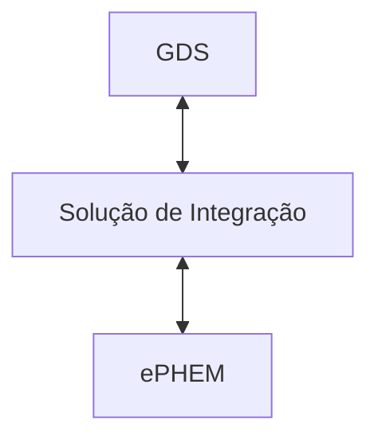

---

---

# Introdução

A comunicação entre o [GDS](../glossario#guardiões-da-saúde-gds) e a [ePHEM](../glossario#ephem) é feita através de uma solução de integração. A solução de integração é responsável por intermediar as requisições entre o GDS e a ePHEM, garantindo que os dados trafeguem de forma segura e eficiente.

Os casos de uso são descritos nas próximas seções.
