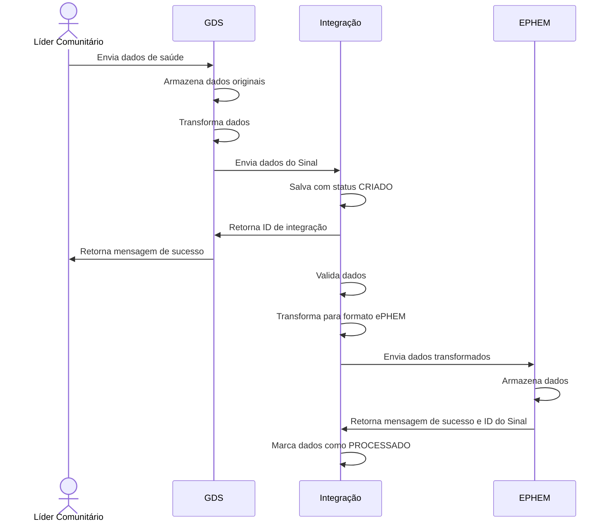
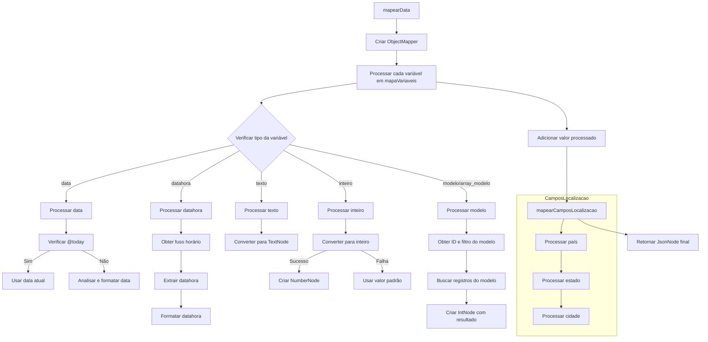
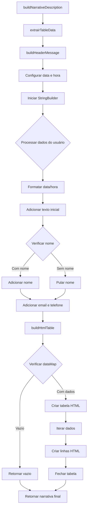

---

---

# Enviar de Sinais

Em relação ao fluxo de envio de um sinal, temos o seguinte cenário:

1. Quando o [Líder Comunitário](../glossario#líderliderança-comunitária) realiza uma ação no [GDS](../glossario#guardiões-da-saúde-gds), o dado é persistido no banco de dados do GDS. Neste ponto, temos a informação disponível para ser compartilhada com a Solução de Integração.
2. Os dados então são transformados antes de serem enviados para o  [ePHEM](../glossario#ephem). A transformação é necessária para que os dados estejam no formato correto para serem consumidos pelo sistema de integração.
3. O sistema de integração recebe o dado e inicialmente persiste-o em um banco de dados, marcando-o como CRIADO. Ele develove o id de integração para o GDS.
4. O sistema de integração, periodicamente, lê os dados marcados como CRIADO, faz a validação, executa uma nova transformação e envia o dado para a ePHEM. Após o envio, o dado é marcado como PROCESSADO.



## Dicionário de Dados

Consiste em um documento que descreve os dados que serão compartilhados entre as duas plataformas.


### Dicionário de Dados do GDS

#### rev10

| Campo                      | Tipo         | Obrigatório | Dependência                        | Domínio                                         | Descrição                                                                             |
| -------------------------- | ------------ | ----------- | ---------------------------------- | ----------------------------------------------- | ------------------------------------------------------------------------------------- |
| evento_descricao           | select       | Sim         | Não                                | Ver tabela A                                    | Descrição do evento ocorrido com opções predefinidas para pessoas, animais e ambiente |
| evento_qtde_envolvidos     | multiple     | Sim         | Não                                | Ver tabela B                                    | Quantidade de envolvidos com faixas predefinidas                                      |
| evento_afetados            | multi-select | Sim         | evento_descricao                   | Ver tabela C                                    | Categorias de afetados                                                                |
| evento_sabe_quando_ocorreu | multiple     | Sim         | Não                                | Ver tabela D                                    | Indica se sabe a data do evento                                                       |
| evento_data_ocorrencia     | date         | Não         | evento_sabe_quando_ocorreu = "Sim" | Data válida                                     | Data em que o evento ocorreu                                                          |
| evento_estado_ocorrencia   | geo_state    | Sim         | Não                                | Estados/Distritos válidos                       | Estado ou distrito onde ocorreu o evento                                              |
| evento_cidade_ocorrencia   | geo_city     | Sim         | Não                                | Cidades/Concelhos válidos do estado selecionado | Cidade ou concelho onde ocorreu o evento                                              |
| evento_local_ocorrencia    | geo_location | Sim         | Não                                | Texto indicando localização                     | Localização específica do evento                                                      |
| evento_detalhes            | text         | Não         | Não                                | Texto livre                                     | Campo para detalhes adicionais sobre o evento                                         |

##### Tabela A - Valores possíveis para evento_descricao
| Valor                                                                 | Categoria |
| --------------------------------------------------------------------- | --------- |
| Pessoas doentes com sintomas parecidos                                | pessoas   |
| Pessoas mortas de forma inexplicada                                   | pessoas   |
| Pessoas doentes com sintomas novos ou raros                           | pessoas   |
| Pessoas afetadas por fenômenos ambientais                             | pessoas   |
| Animais mortos de forma inexplicada                                   | animais   |
| Animais doentes com sintomas parecidos                                | animais   |
| Animais afetadas por fenômenos ambientais                             | animais   |
| Problema ambiental (contaminação, enchente, queimada, bruma seca,...) | ambiente  |

##### Tabela B - Valores possíveis para evento_qtde_envolvidos
| Valor         |
| ------------- |
| apenas 1      |
| entre 2 e 5   |
| entre 6 e 10  |
| entre 11 e 20 |
| acima de 20   |

##### Tabela C - Valores possíveis para evento_afetados
| Valor               | Categoria |
| ------------------- | --------- |
| Adultos             | pessoas   |
| Crianças            | pessoas   |
| Idosos              | pessoas   |
| Pessoas em geral    | pessoas   |
| Animais domésticos  | animais   |
| Animais de produção | animais   |
| Animais selvagens   | animais   |
| Ambiente            | ambiente  |
| Não sei             | all       |

##### Tabela D - Valores possíveis para evento_sabe_quando_ocorreu
| Valor |
| ----- |
| Sim   |
| Não   |


### Dicionário de dados do Integrador

O contrato de entrada do Integrador, segue o mapeamento definido no json a seguir e detalhado por meio das tabelas subsequentes.

#### Definição de Mapeamento

Está é a última versão do mapeamento de dados do Integrador.

<details>
  <summary>Definição de Mapeamento</summary>
```json
{
  "id": 1,
  "definition": {
    "type": "object",
    "title": "Product",
    "$schema": "http://json-schema.org/draft-07/schema#",
    "required": [
      "general_hazard_id",
      "confidentiality",
      "specific_hazard_id",
      "country_ids",
      "state_ids",
      "signal_type",
      "report_date",
      "incident_date"
    ],
    "properties": {
      "states_ids": {
        "type": "array",
        "items": {
          "type": "array",
          "items": {
            "oneOf": [
              {
                "type": "integer",
                "minimum": 0
              },
              {
                "type": "array",
                "items": {
                  "type": "integer",
                  "minimum": 0
                }
              }
            ]
          }
        }
      },
      "country_ids": {
        "type": "array",
        "items": {
          "type": "array",
          "items": {
            "oneOf": [
              {
                "type": "integer",
                "minimum": 0
              },
              {
                "type": "array",
                "items": {
                  "type": "integer",
                  "minimum": 0
                }
              }
            ]
          }
        }
      },
      "report_date": {
        "type": "string",
        "format": "datetime"
      },
      "signal_type": {
        "enum": [
          "opening",
          "update",
          "related"
        ],
        "type": "string"
      },
      "district_ids": {
        "type": "array",
        "items": {
          "type": "array",
          "items": {
            "oneOf": [
              {
                "type": "integer",
                "minimum": 0
              },
              {
                "type": "array",
                "items": {
                  "type": "integer",
                  "minimum": 0
                }
              }
            ]
          }
        }
      },
      "incident_date": {
        "type": "string",
        "format": "datetime"
      },
      "confidentiality": {
        "enum": [
          "level_5",
          "level_4",
          "level_3",
          "level_2",
          "level_1"
        ],
        "type": "string"
      },
      "general_hazard_id": {
        "type": "integer"
      },
      "specific_hazard_id": {
        "type": "integer"
      }
    },
    "description": "Esquema que representa um'signal'do Ephem(Odoo)"
  },
  "createdAt": null,
  "updatedAt": "2024-08-15T23:20:51.400209Z",
  "inputEphemMap": {
    "address": {
      "from": [
        "evento_local_ocorrencia"
      ],
      "type": "string",
      "default_value": ""
    },
    "state_ids": {
      "from": [
        "evento_estado_ocorrencia"
      ],
      "type": "model_array",
      "model_name": "res.country.state",
      "default_value": "0",
      "model_property_filter": "name"
    },
    "country_ids": {
      "from": [
        "evento_pais_ocorrencia"
      ],
      "type": "model_array",
      "model_name": "res.country",
      "default_value": "0",
      "model_property_filter": "name"
    },
    "report_date": {
      "from": [
        "evento_data_reporte"
      ],
      "type": "datetime",
      "from_format": [
        "dd-MM-yyyy",
        "yyyy-MM-dd'T'HH:mm:ssSXXX"
      ],
      "default_value": "@now"
    },
    "signal_type": {
      "from": [],
      "type": "string",
      "default_value": "opening"
    },
    "district_ids": {
      "from": [
        "evento_cidade_ocorrencia"
      ],
      "type": "model_array",
      "model_name": "res.country.state.district",
      "default_value": "@search('Nova Localidade')",
      "model_property_filter": "name"
    },
    "incident_date": {
      "from": [
        "evento_data_ocorrencia"
      ],
      "type": "datetime",
      "from_format": [
        "dd-MM-yyyy",
        "yyyy-MM-dd'T'HH:mm:ssSXXX"
      ],
      "default_value": "@today"
    },
    "confidentiality": {
      "from": [],
      "type": "string",
      "default_value": "level_1"
    },
    "general_hazard_id": {
      "from": [],
      "type": "integer",
      "default_value": "0"
    },
    "specific_hazard_id": {
      "from": [],
      "type": "integer",
      "default_value": "0"
    }
  },
  "locationMap": {
    "state_source_field": "evento_estado_ocorrencia",
    "country_source_field": "evento_pais_ocorrencia",
    "district_source_field": "evento_cidade_ocorrencia"
  }
}
```
</details>


#### Tabela Principal de Mapeamento
| Campo Destino (Odoo) | Campo Origem             | Tipo        | Valor Padrão               | Modelo/Filtro                     |
| -------------------- | ------------------------ | ----------- | -------------------------- | --------------------------------- |
| address              | evento_local_ocorrencia  | string      | ""                         | -                                 |
| state_ids            | evento_estado_ocorrencia | model_array | 0                          | res.country.state (name)          |
| country_ids          | evento_pais_ocorrencia   | model_array | 0                          | res.country (name)                |
| report_date          | evento_data_reporte      | datetime    | @now                       | -                                 |
| signal_type          | -                        | string      | "opening"                  | -                                 |
| district_ids         | evento_cidade_ocorrencia | model_array | @search('Nova Localidade') | res.country.state.district (name) |
| incident_date        | evento_data_ocorrencia   | datetime    | @today                     | -                                 |
| confidentiality      | -                        | string      | "level_1"                  | -                                 |
| general_hazard_id    | -                        | integer     | 0                          | -                                 |
| specific_hazard_id   | -                        | integer     | 0                          | -                                 |

#### Tabela de Formatos de Data Aceitos
| Campo         | Formatos Aceitos                      |
| ------------- | ------------------------------------- |
| report_date   | dd-MM-yyyy, yyyy-MM-dd'T'HH:mm:ssSXXX |
| incident_date | dd-MM-yyyy, yyyy-MM-dd'T'HH:mm:ssSXXX |

#### Tabela de Valores Enumerados
| Campo           | Valores Possíveis                           |
| --------------- | ------------------------------------------- |
| signal_type     | opening, update, related                    |
| confidentiality | level_5, level_4, level_3, level_2, level_1 |

#### Tabela de Campos de Localização

| Tipo de Localização | Campo Fonte              |
| ------------------- | ------------------------ |
| Estado              | evento_estado_ocorrencia |
| País                | evento_pais_ocorrencia   |
| Distrito/Cidade     | evento_cidade_ocorrencia |

#### Tabela de Campos Obrigatórios

| Campo              |
| ------------------ |
| general_hazard_id  |
| confidentiality    |
| specific_hazard_id |
| country_ids        |
| state_ids          |
| signal_type        |
| report_date        |
| incident_date      |


#### Definição de Contrato de Entrada

<details>
  <summary>Definição de Contrato de Entrada</summary>

```json
{
    "eventoIntegracaoTemplate": "/1",
    "userId": 3,
    "userEmail": "juca@teste.com",
    "eventSourceId": 1,
    "eventSourceLocation": "comunidade B",
    "eventSourceLocationId": 1,
    "data": {
        "evento_descricao": "Duas ou mais pessoas doentes com sintomas parecidos",
        "evento_detalhes": "N",
        "evento_qtde_envolvidos": "apenas 1",
        "evento_afetados": "Ambiente",
        "evento_sabe_quando_ocorreu": "Sim",
        "evento_data_ocorrencia": "26-08-2023",
        "evento_local_ocorrencia": "Gama",
        "evento_pais_ocorrencia": "Brasil",
        "evento_estado_ocorrencia": "Distrito Federal",
        "evento_cidade_ocorrencia": "Brasília"
    },
    "aditionalData": {
        "Tipo de Notificação": "Coletiva",
        "Tipo de Ocorrência": "Em Humanos",
        "Quantos Envolvidos": "Mais de 5",
        "Localidade": "Gama"
    }
}
```

</details>

#### Contrato de Entrada do Integrador

| Campo                    | Tipo    | Obrigatório | Descrição                                                                                                         |
| ------------------------ | ------- | ----------- | ----------------------------------------------------------------------------------------------------------------- |
| eventoIntegracaoTemplate | string  | Sim         | Identificador do template. Valor fixo "/1"                                                                        |
| userId                   | integer | Sim         | ID do usuário que está realizando a integração                                                                    |
| userEmail                | string  | Sim         | Email do usuário que está realizando a integração                                                                 |
| eventSourceId            | integer | Sim         | ID da fonte do evento                                                                                             |
| eventSourceLocation      | string  | Sim         | Nome da localização da fonte do evento                                                                            |
| eventSourceLocationId    | integer | Sim         | ID da localização da fonte do evento. Se não houver, enviar valor fixo 1                                          |
| data                     | object  | Sim         | Objeto com os dados do evento que devem obedecer ao [mapeamento definido no Integrador](#definição-de-mapeamento) |
| additionalData           | object  | Sim         | Objeto com dados adicionais que serão incluídos na [Narrativa do Evento](../glossario#narrativa)                  |

## Objeto data
| Campo                       | Tipo   | Exemplo                                               | Descrição                           |
| --------------------------- | ------ | ----------------------------------------------------- | ----------------------------------- |
| evento_descricao            | string | "Duas ou mais pessoas doentes com sintomas parecidos" | Descrição do evento                 |
| evento_detalhes             | string | "N"                                                   | Detalhes adicionais do evento       |
| evento_qtde_envolvidos      | string | "apenas 1"                                            | Quantidade de envolvidos no evento  |
| evento_afetados             | string | "Ambiente"                                            | Tipo de afetados pelo evento        |
| evento_sabe_quando_ocorreu  | string | "Sim"                                                 | Indica se sabe a data do evento     |
| evento_data_ocorrencia      | string | "26-08-2023"                                          | Data do evento (formato dd-MM-yyyy) |
| evento_local_ocorrencia     | string | "Gama"                                                | Local específico do evento          |
| evento_pais_ocorrencia      | string | "Brasil"                                              | País onde ocorreu o evento          |
| evento_estado_ocorrencia    | string | "Distrito Federal"                                    | Estado onde ocorreu o evento        |
| evento_municipio_ocorrencia | string | "Brasília"                                            | Município onde ocorreu o evento     |

## Objeto additionalData
| Campo               | Tipo   | Exemplo      | Descrição                            |
| ------------------- | ------ | ------------ | ------------------------------------ |
| Tipo de Notificação | string | "Coletiva"   | Classificação do tipo de notificação |
| Tipo de Ocorrência  | string | "Em Humanos" | Classificação do tipo de ocorrência  |
| Quantos Envolvidos  | string | "Mais de 5"  | Quantidade de envolvidos detalhada   |
| Localidade          | string | "Gama"       | Nome da localidade do evento         |


#### Fluxo do Mapeamento do Sinal no Integrador



#### Fluxo do Mapeamento do Sinal no Integrador - Narrativa do Evento




### Dicionário de Dados do ePHEM

O ePHEM é baseado no Odoo assim a integração não é feita usando XML por meio de uma biblioteca Java (org.apache.xmlrpc.client.XmlRpcClient) que faz a chamada para o método execute do ePHEM.

Para inferir os métodos e os parâmetros que devem ser passados, foi necessário analisar as requisicoes HTTP feitas pelo Odoo. A partir disso, foi possível inferir os métodos e os parâmetros que devem ser passados.

#### Contrato de Entrada do ePHEM

É o resultado do mapeamento de dados do Integrador para o ePHEM.

#### Tabela de Campos Obrigatórios

| Campo              |
| ------------------ |
| general_hazard_id  |
| confidentiality    |
| specific_hazard_id |
| country_ids        |
| state_ids          |
| signal_type        |
| report_date        |
| incident_date      |
