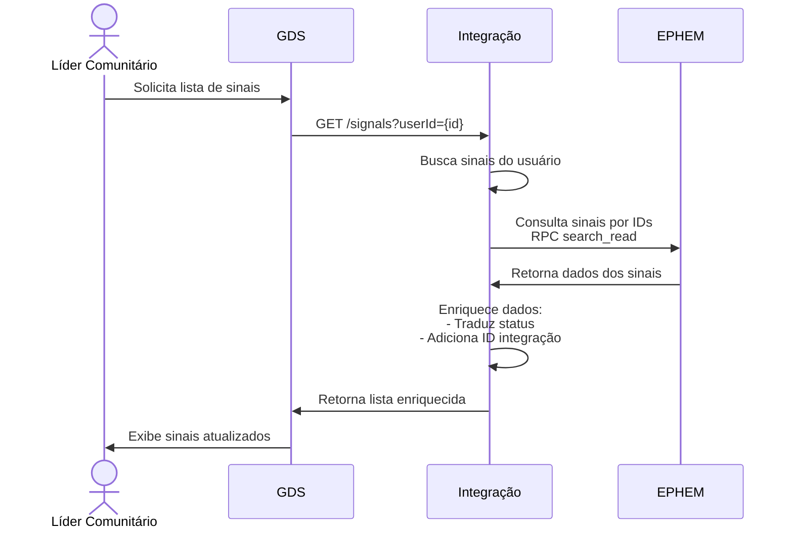

---

---

# Acompanhar Status Sinais

Uma vez que o dado foi enviado para a [ePHEM](../glossario#ephem), e o [GDS](../glossario#guardiões-da-saúde-gds) salvou o id de integração, o GDS  pode consultar o status do dado por meio da API de Integração. Ou seja, o GDS pode consultar se o dado foi processado com sucesso, se houve erro, ou se o dado ainda está em processamento.

## Tradução de Status

Essa tabela representa o mapeamento de tradução de status implementado no código Java. Cada status em inglês é traduzido para seu correspondente em português quando o método traduzirStatus() é chamado na classe Signal.

| Inglês          | Português        |
| --------------- | ---------------- |
| verification    | Em análise       |
| raw information | Informado        |
| discarded       | Descartado       |
| monitoring      | Em monitoramento |
| event           | Evento           |
| closed          | Encerrado        |
| invalid         | -                |
