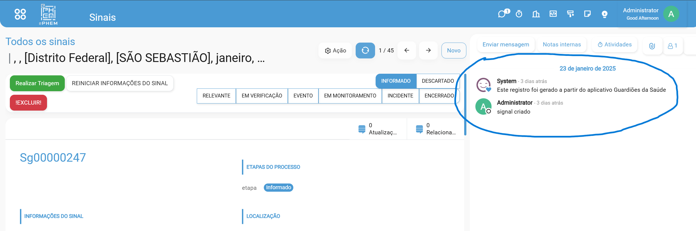
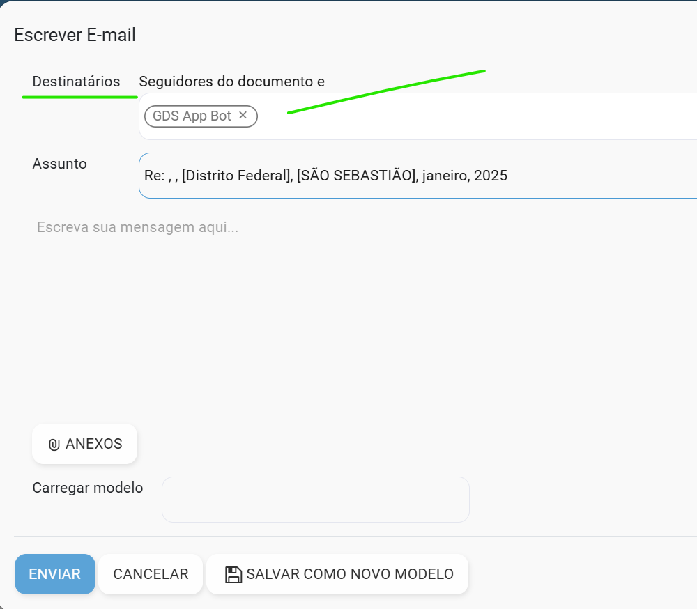
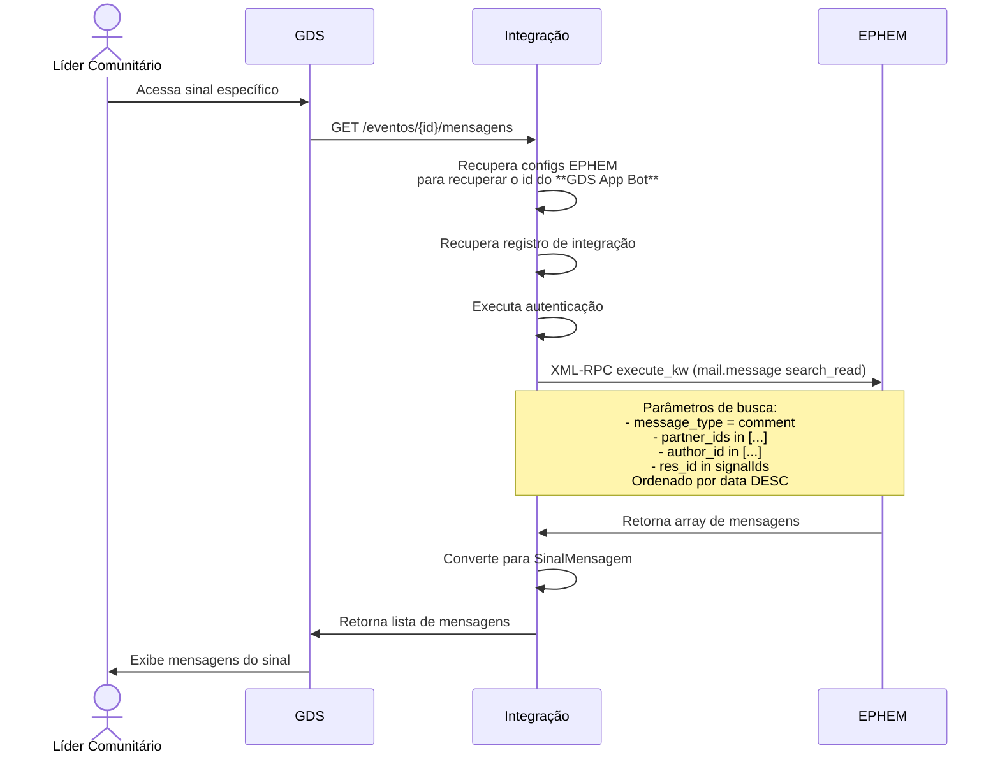

---

---

# Listar Mensagens de um Sinal

## Contexto

O [ePHEM](../glossario.md#ephem) possui um sistema de comunicação integrado onde cada evento tem sua própria área de mensagens. Este sistema permite:

1. Troca de mensagens entre os usuários envolvidos no [Sinal](../glossario.md#sinal)
2. Armazenamento do histórico completo das conversas
3. Acompanhamento de todas as interações relacionadas ao [Sinal](../glossario.md#sinal)

Isso funciona como um chat dedicado por evento, mantendo todas as comunicações organizadas e facilmente acessíveis.

A imagem acima é uma captura de tela do ePHEM em que está destacado o sistema de mensagens associado a um evento. O usuário pode enviar mensagens para o evento, e essas mensagens são armazenadas no sistema de mensagens do ePHEM.

### Enviar Mensagem para um Sinal

Para que o usuário do ePHEM registre uma mensagem que poderá ser visualizada no GDS, é necessário que ao criar a mensagem, o usuário defina como destinário o usuário "GDS App Bot". Dessa forma, a mensagem será enviada para o GDS e poderá ser visualizada no sistema.

A imagem acima é uma captura de tela do ePHEM em que está destacado o envio de mensagem para um evento. Destaque para o destinatário "GDS App Bot".

## Integração

O Líder Comunitário pode listar as mensagens associadas a um evento no ePHEM por meio do GDS. Para isso, o GDS acessa o sinal específico e solicita a lista de mensagens associadas a esse sinal.

Este diagrama mostra o fluxo completo de consulta de mensagens de um sinal específico, incluindo:

- Início da solicitação pelo Líder Comunitário
- Consulta do GDS ao Integrador
- Processo de autenticação e configuração no Integrador
- Chamada RPC ao EPHEM com os parâmetros de filtro
- Conversão e retorno dos dados
- Exibição final para o usuário
