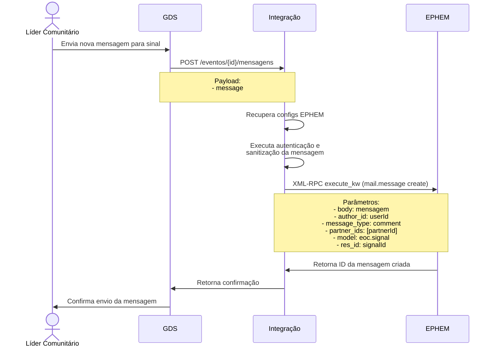

---

---

# Enviar Mensagem para um Sinal

## Contexto

O [ePHEM](../glossario.md#ephem) possui um sistema de comunicação integrado onde cada evento tem sua própria área de mensagens. Este sistema permite:

1. Troca de mensagens entre os usuários envolvidos no [Sinal](../glossario.md#sinal)
2. Armazenamento do histórico completo das conversas
3. Acompanhamento de todas as interações relacionadas ao [Sinal](../glossario.md#sinal)

Isso funciona como um chat dedicado por evento, mantendo todas as comunicações organizadas e facilmente acessíveis.

A imagem acima é uma captura de tela do ePHEM em que está destacado o sistema de mensagens associado a um evento. O usuário pode enviar mensagens para o evento, e essas mensagens são armazenadas no sistema de mensagens do ePHEM.

## Integração

O Líder Comunitário pode enviar mensagens associadas a um evento no ePHEM por meio do GDS. Para isso, o Líder Comunitário acessa o sinal específico e envia a mensagem associada a esse sinal.

Este diagrama mostra o fluxo de criação de uma nova mensagem, onde:

- O Líder Comunitário envia uma mensagem através do app
- O GDS encaminha para o Integrador com os dados necessários
- O Integrador prepara a autenticação e os parâmetros além de sanitizar a mensagem
- É feita uma chamada RPC ao EPHEM para criar a mensagem
- O EPHEM retorna o ID da nova mensagem
- A confirmação é enviada de volta ao usuário

A principal diferença do fluxo de listagem de mensagens associadas a um sinal é que aqui usamos o método "create" do mail.message ao invés do "search_read", e enviamos os dados da nova mensagem ao invés de parâmetros de busca.
