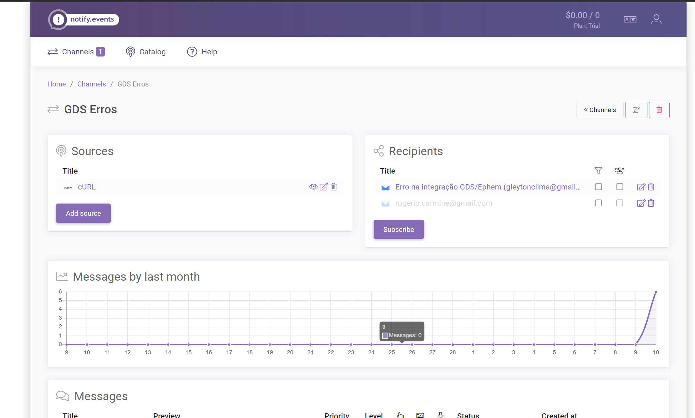

---

---

# Notificação de erros com Notify.events

Este documento descreve a solução implementada para notificar erros ocorridos durante o processamento de eventos no Integrador. Utilizamos o serviço Notify.events como plataforma para envio de notificações.



## Visão Geral

O sistema precisava de uma forma eficiente e confiável de notificar os desenvolvedores quando ocorressem erros no processamento de eventos, especialmente durante execuções do agendador que roda periodicamente. A solução implementada captura os erros, formata mensagens detalhadas e as envia para múltiplos canais de comunicação via Notify.events.

[Notify.events](https://notify.events) é um serviço de notificação que permite enviar mensagens para diversos canais, como email, Telegram, Slack, Discord e outros. Ele oferece um plano gratuito generoso e suporte a formatação de mensagens ricas em Markdown.

Permite até 50 notificações por mês no plano gratuito, com suporte a múltiplos canais de comunicação. A solução foi escolhida por sua simplicidade de uso, baixo custo e flexibilidade para notificar a equipe sobre problemas críticos no sistema.

## Arquitetura da Solução

### 1. Interface de Notificação

Criamos uma interface para desacoplar o mecanismo de notificação da lógica de negócios, seguindo o princípio de inversão de dependência. Esta interface expõe um método simples para notificar sobre erros, recebendo um título, uma mensagem e o objeto de exceção.

### 2. Implementação com Notify.events

A implementação concreta utiliza o serviço Notify.events e consiste em:

- **Configuração do canal**: Utiliza o URL do canal configurado no arquivo de propriedades
- **Cliente HTTP**: Usa o RestTemplate do Spring para realizar chamadas à API do Notify.events
- **Formatação de mensagens**: Formata os detalhes do erro em Markdown para melhor legibilidade
- **Envio de notificações**: Envia os dados via requisição POST com formato multipart/form-data

A implementação lida com a formatação de mensagens ricas que incluem:
- Detalhes do evento que falhou
- Stack trace do erro para diagnóstico
- Informações do ambiente de execução
- Data e hora do incidente

### 3. Integração no Agendador de Eventos

O agendador de eventos foi modificado para utilizar o serviço de notificação quando ocorrem erros no processamento. Quando uma exceção é capturada:

1. O erro é registrado nos logs
2. Uma notificação detalhada é preparada com informações sobre o evento que falhou
3. A notificação é enviada via Notify.events
4. O status do evento é atualizado para refletir o erro

### 4. Configuração

A solução requer apenas a configuração de um URL de canal no arquivo de propriedades do aplicativo. Este URL é fornecido pelo Notify.events ao configurar uma origem de notificação (source). A variável de ambiente `NOTIFY_EVENTS_CHANNEL_URL` é usada para armazenar o URL do canal.

## Configuração do Notify.events

Para configurar o serviço Notify.events:

1. **Criar uma conta** no [Notify.events](https://notify.events)
2. **Criar um canal** de notificação
3. **Adicionar destinatários** ao canal (email, Telegram, Slack, Discord, etc.)
4. **Criar uma origem de notificação** ("source") usando o tipo "Universal" ou "Generic API"
5. **Obter o URL do canal** que será usado na configuração da aplicação

## Formato das Notificações

As notificações de erro incluem:

- **Título**: Identificação clara do evento que falhou
- **Detalhes do Erro**: Mensagem descritiva sobre o problema
- **Stack Trace**: As primeiras linhas do stack trace para diagnóstico
- **Informações do Ambiente**: Detalhes sobre o ambiente onde ocorreu o erro
  - Hostname
  - Sistema operacional
  - Versão do Java

O conteúdo é formatado em Markdown para melhor legibilidade nos canais de notificação.

## Benefícios da Solução

- **Múltiplos canais**: Notificações podem ser recebidas em email, Telegram, Slack, Discord e outros
- **Plano gratuito generoso**: 50 notificações por mês no plano gratuito
- **Formato rico**: Suporte a Markdown para formatação das mensagens
- **Integração simples**: Requer apenas um URL para configuração
- **Sem verificação de domínio**: Não é necessário configurar DNS ou validar domínios como em soluções de email

## Alternativas Consideradas

Antes de decidir pelo Notify.events, foram consideradas as seguintes alternativas:

1. **Resend**: Serviço de email moderno com API simples, mas requer verificação de domínio
2. **Mailgun**: Serviço de email com bom plano gratuito, mas também requer verificação
3. **Pushover**: Notificações diretas para smartphone, mas tem custo único
4. **Discord Webhooks**: Solução totalmente gratuita, mas limitada a notificações no Discord

## Exemplo de Notificação

Uma notificação típica enviada pelo sistema contém:

```
Detalhes do Erro

Ocorreu um erro ao processar o evento de integração ID 12345 do tipo EventoXYZ.

**Horário:** 10/03/2025 15:42:31
**Erro:** Falha na conexão com serviço externo
**Tipo:** java.net.ConnectException

Stack trace

Informações do Ambiente

Hostname:** app-server-prod-01
**Sistema:** Linux 5.15.0
**Java:** 17.0.6
```

## Conclusão

A implementação com Notify.events fornece uma solução robusta e flexível para notificação de erros, permitindo que a equipe seja alertada rapidamente sobre problemas na aplicação através de múltiplos canais. Isso melhora significativamente o tempo de resposta a incidentes e a visibilidade de problemas no sistema.

A solução é de baixo custo, fácil manutenção e permite que diferentes membros da equipe recebam notificações em suas plataformas preferidas, sem a necessidade de infraestrutura adicional.