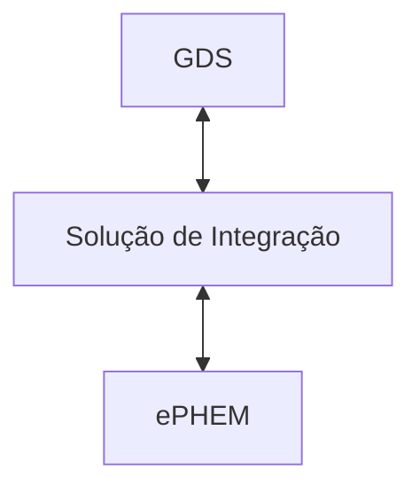

# Casos de Uso

A comunicação entre o GDS e a [ePHEM](../glossario#ephem) é feita através de uma solução de integração. A solução de integração é responsável por enviar os dados do GDS para a ePHEM e por consultar o status dos dados na ePHEM.

Os casos de uso são descritos nas próximas seções.
