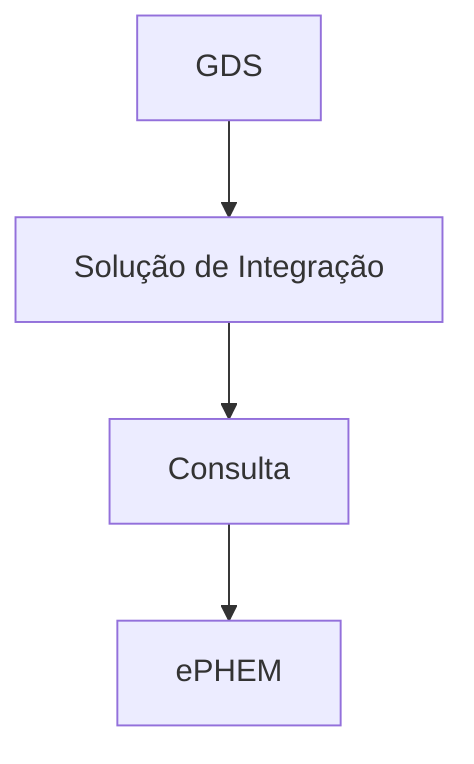

# Fluxo de Acompanhamento de Eventos

Uma vez que o dado foi enviado para a [ePHEM](../glossario#ephem), e o [GDS](../glossario#guardiões-da-saúde-gds) salvou o id de integração, o GDS  pode consultar o status do dado na ePHEM.

1. O GDS consulta o status do dado na evento consultando o próprio sistema de integração.
2. O sistema de integração consulta o status do dado na ePHEM e retorna o status para o GDS.

