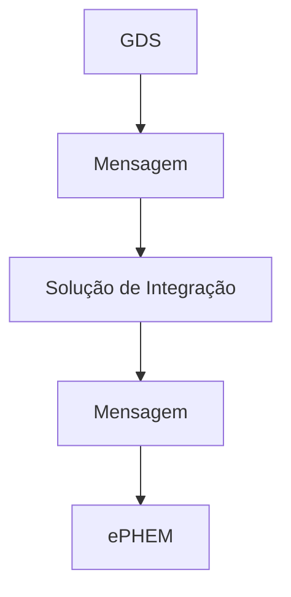

# Fluxo de Envio de Mensagens

Cada evento registrado no ePHEM possui um sistema de mensagens associado. O sistema de mensagens por meio do qual os usuários podem trocar mensagens entre si. O usuário do GDS pode enviar dados adicionais para o evento no ePHEM. Nesse caso, o fluxo é o seguinte:

1. O usuário do GDS envia uma mensagem para o evento no ePHEM.
2. O GDS envia a mensagem para o sistema de integração.
3. O sistema de integração envia a mensagem para a ePHEM.

