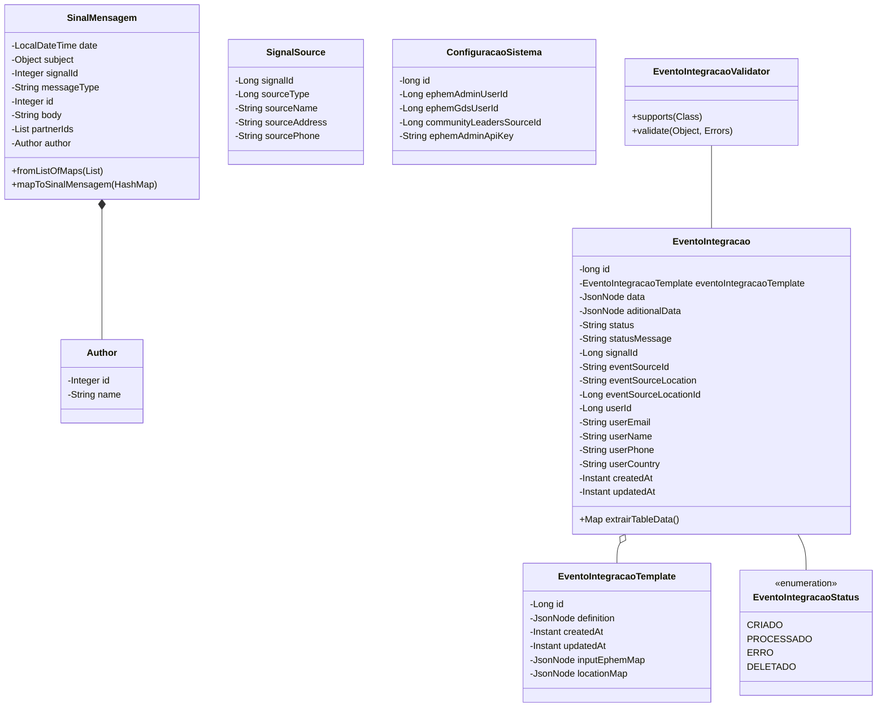

# Modelagem

Nesta seção, descreveremos a modelagem do sistema de integração entre o GDS e a ePHEM.

## Diagrama de Classes

O diagrama de classes a seguir descreve as classes e métodos da solução de integração.

### Tabela: SinalMensagem

| Campo       | Tipo          | Descrição                                |
| ----------- | ------------- | ---------------------------------------- |
| date        | LocalDateTime | Data e hora da mensagem                  |
| subject     | Object        | Assunto/título da mensagem               |
| signalId    | Integer       | Identificador único do sinal relacionado |
| messageType | String        | Tipo da mensagem                         |
| id          | Integer       | Identificador único da mensagem          |
| body        | String        | Corpo/conteúdo da mensagem               |
| partnerIds  | Lista         | Lista de IDs dos parceiros relacionados  |
| author      | Author        | Informações do autor da mensagem         |

### Tabela: Author

| Campo | Tipo    | Descrição                    |
| ----- | ------- | ---------------------------- |
| id    | Integer | Identificador único do autor |
| name  | String  | Nome do autor                |

### Tabela: SignalSource

| Campo         | Tipo   | Descrição                    |
| ------------- | ------ | ---------------------------- |
| signalId      | Long   | Identificador único do sinal |
| sourceType    | Long   | Tipo da fonte do sinal       |
| sourceName    | String | Nome da fonte                |
| sourceAddress | String | Endereço da fonte            |
| sourcePhone   | String | Telefone da fonte            |

### Tabela: EventoIntegracao

| Campo                    | Tipo                     | Descrição                                  |
| ------------------------ | ------------------------ | ------------------------------------------ |
| id                       | long                     | Identificador único do evento              |
| eventoIntegracaoTemplate | EventoIntegracaoTemplate | Template associado ao evento               |
| data                     | JsonNode                 | Dados do evento em formato JSON            |
| aditionalData            | JsonNode                 | Dados adicionais do evento em formato JSON |
| status                   | String                   | Status atual do evento                     |
| statusMessage            | String                   | Mensagem detalhando o status               |
| signalId                 | Long                     | Identificador do sinal relacionado         |
| eventSourceId            | String                   | Identificador da fonte do evento           |
| eventSourceLocation      | String                   | Localização da fonte do evento             |
| eventSourceLocationId    | Long                     | ID da localização da fonte                 |
| userId                   | Long                     | ID do usuário responsável                  |
| userEmail                | String                   | Email do usuário                           |
| userName                 | String                   | Nome do usuário                            |
| userPhone                | String                   | Telefone do usuário                        |
| userCountry              | String                   | País do usuário                            |
| createdAt                | Instant                  | Data e hora de criação                     |
| updatedAt                | Instant                  | Data e hora da última atualização          |

### Tabela: EventoIntegracaoTemplate

| Campo         | Tipo     | Descrição                             |
| ------------- | -------- | ------------------------------------- |
| id            | Long     | Identificador único do template       |
| definition    | JsonNode | Definição do template em formato JSON |
| createdAt     | Instant  | Data e hora de criação                |
| updatedAt     | Instant  | Data e hora da última atualização     |
| inputEphemMap | JsonNode | Mapeamento de entrada EPHEM em JSON   |
| locationMap   | JsonNode | Mapeamento de localização em JSON     |

### Tabela: ConfiguracaoSistema

| Campo                    | Tipo   | Descrição                            |
| ------------------------ | ------ | ------------------------------------ |
| id                       | long   | Identificador único da configuração  |
| ephemAdminUserId         | Long   | ID do usuário administrador EPHEM    |
| ephemGdsUserId           | Long   | ID do usuário GDS no EPHEM           |
| communityLeadersSourceId | Long   | ID da fonte dos líderes comunitários |
| ephemAdminApiKey         | String | Chave de API do administrador EPHEM  |

### Enum: EventoIntegracaoStatus

| Valor      | Descrição                                  |
| ---------- | ------------------------------------------ |
| CRIADO     | Evento foi criado mas ainda não processado |
| PROCESSADO | Evento foi processado com sucesso          |
| ERRO       | Ocorreu um erro durante o processamento    |
| DELETADO   | Evento foi marcado como deletado           |