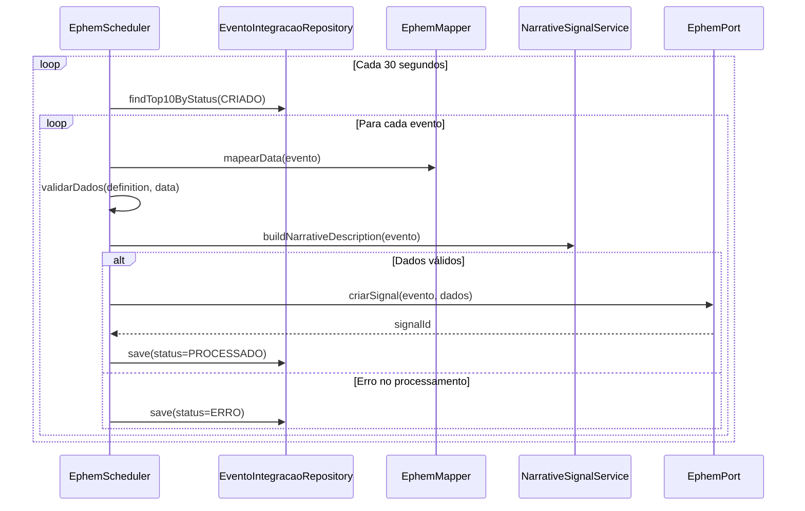

# Processos Assíncronos

## Visão Geral

O `EphemScheduler` é um componente responsável pela integração automática de eventos com o sistema ePHEM. Ele executa periodicamente a verificação de novos eventos e realiza seu processamento e envio.

## Funcionamento

### Agendamento
- O scheduler é executado a cada 30 segundos
- Possui um delay inicial de 10 segundos após a inicialização
- Processa no máximo 10 eventos por execução
- Limita-se a 5 iterações por ciclo de execução

### Fluxo de Processamento
1. Busca os 10 primeiros eventos com status "CRIADO"
2. Para cada evento:
   - Mapeia os dados do evento para o formato EPHEM
   - Valida os dados contra um schema JSON
   - Gera uma descrição narrativa do sinal
   - Envia o sinal para o EPHEM
   - Atualiza o status do evento

### Estados Possíveis

Ver [Enum: EventoIntegracaoStatus](./02-modelagem.md#enum-eventointegracaostatus)

### Tratamento de Erros
- Mensagens de erro são limitadas a 255 caracteres
- Erros são registrados no log do sistema
- Eventos com erro são marcados e mantêm a mensagem de erro

## Diagrama de Sequência

## Validações
- Verifica conformidade com schema JSON (versão 7)
- Valida estrutura dos dados mapeados
- Garante integridade das informações antes do envio

## Dependências
- TransactionTemplate: Gerenciamento de transações
- EventoIntegracaoRepository: Acesso aos dados
- EphemPort: Interface com sistema EPHEM
- NarrativeSignalService: Geração de descrições
- EphemMapper: Mapeamento de dados

## Considerações Técnicas
- Utiliza transações para garantir consistência
- Implementa mecanismo de defesa contra loops infinitos
- Realiza log de todas as operações relevantes
- Limita tamanho das mensagens de erro
- Processa eventos em lotes para melhor performance